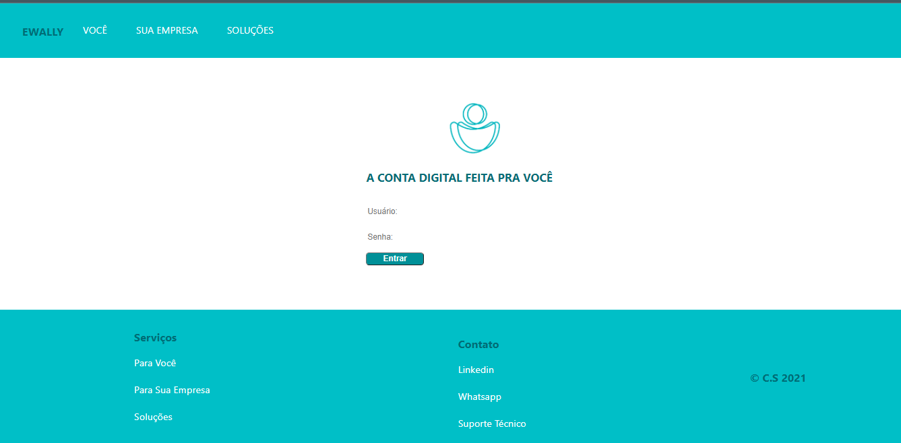
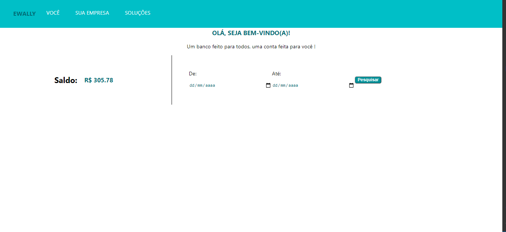
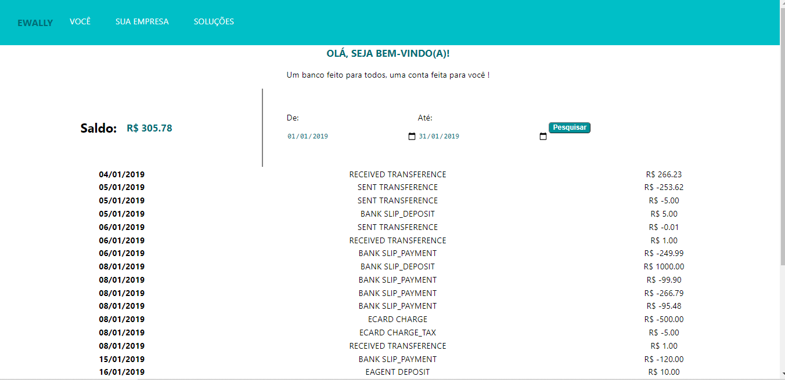

    

<h1 align ="center"> Ewally Bank </h1> 

Web Banking com Integração a API's Ewally 

    
    
    

<h1 id = "sobre"> :green_book: Sobre </h1>  
 
 Ewally Bank é um projeto de Web Banking para acesso a conta digital Ewally.
 Disponível consulta do Extrato e Consulta do histórico de transações

Este projeto foi gerado com [REACT](https://pt-br.reactjs.org/) versão 17.0.2. 

#  :chart_with_upwards_trend: Tabela de Conteúdos
=================
<!--ts-->
   * [Sobre](#sobre)
   * [Instalação](#instalacao)
   * [Features](#features)
   * [Como usar](#como-usar)
   * [Licença](#licenca) 
   * [Autora](#autora)
   * [Agradecimentos](#agradecimentos)
<!--te-->

<h4 align="center"> 
    :round_pushpin:  Ewally Banking 🚀 Finalizado  :round_pushpin:
</h4>

<h1 id = "instalacao"> :floppy_disk: Instalação </h1>
 
 Clone o repositório em um pasta desejada com git: 
 
 `git clone https://github.com/Cibsantos/Ewally_Banking.git` 
 
 Execute `npm install` ou `yarn install`

Para executar o Web Banking `npm start` ou `yarn start` na pasta raiz do projeto e iniciará um servidor de desenvolvimento. Navegue até `http://localhost:3000/`. O aplicativo será recarregado automaticamente se você alterar qualquer um dos arquivos de origem.

<h1 id = "features"> :heavy_check_mark: Features </h1>

- [x] Login
- [x] Consulta Saldo
- [x] Consuta Extrato

<h1 id = "como-usar"> :dart: Como Usar </h1>

Login

Para Acessar ao Web Banking use:

`user: testFrontEwally` 
`psw: 123456` 

Consulta Extrato

Para Consulta do extrato utilize o período de: 01/01/2019 até 31/01/2019

<h3 id = #demonstracao> Demonstração </h3>

 Login

 Saldo

 Extrato

#### Padrão Commits Segundo a Udacity
Disponível em: http://udacity.github.io/git-styleguide/

<h1 id = "licenca"> :lock: Licença </h1>

Permission is hereby granted, free of charge, to any person obtaining a copy
of this software and associated documentation files (the "Software"), to deal
in the Software without restriction, including without limitation the rights
to use, copy, modify, merge, publish, distribute, sublicense, and/or sell
copies of the Software, and to permit persons to whom the Software is
furnished to do so, subject to the following conditions:

The above copyright notice and this permission notice shall be included in all
copies or substantial portions of the Software.

THE SOFTWARE IS PROVIDED "AS IS", WITHOUT WARRANTY OF ANY KIND, EXPRESS OR
IMPLIED, INCLUDING BUT NOT LIMITED TO THE WARRANTIES OF MERCHANTABILITY,
FITNESS FOR A PARTICULAR PURPOSE AND NONINFRINGEMENT. IN NO EVENT SHALL THE
AUTHORS OR COPYRIGHT HOLDERS BE LIABLE FOR ANY CLAIM, DAMAGES OR OTHER
LIABILITY, WHETHER IN AN ACTION OF CONTRACT, TORT OR OTHERWISE, ARISING FROM,
OUT OF OR IN CONNECTION WITH THE SOFTWARE OR THE USE OR OTHER DEALINGS IN THE
SOFTWARE.

<h1 id = "autora">  :pencil2: Autora </h1>

    
    

        Desenvolvido com :heart: por <a href = "https://github.com/Cibsantos"> Cibele Santos </a> 
        entre em contato :muscle:
    
   

    
    
    

<h1 id = "agradecimentos"> :clap: Agradecimentos </h1>

Obrigada pela oportunidade de demonstrar meus conhecimentos, espero que gostem do projeto 
e qualquer dúvida me coloco á disposição. 

